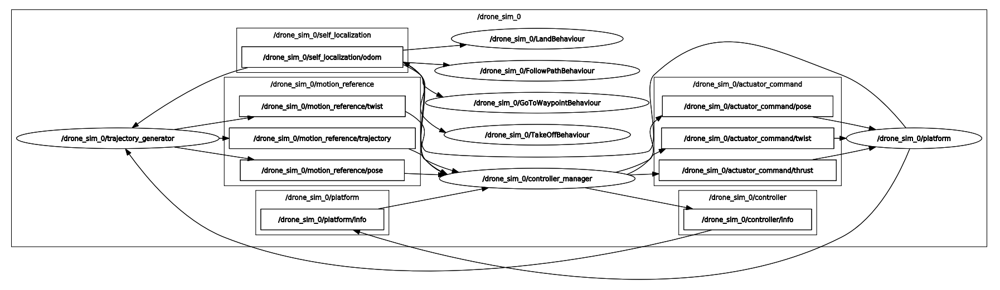

# project_mbzirc

## Launch instructions 

Launch assets for MBZIRC22 project.

- Launch Ignition gazebo simulator:
```
./launch_ignition.bash
```

- Launch AS2:
```
./main_launcher.bash <number-of-as2-instances:=1>
```

- Stop AS2 nodes:
```
./stop
```

## AS2 Node Graph

