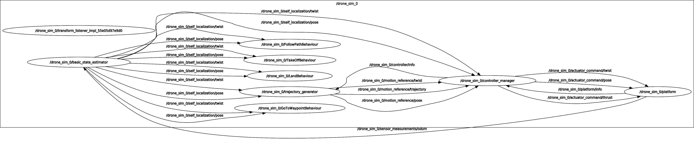

# project_mbzirc

AS2 project for the MBZIRC22 Maritime Grand Challenge. It gathers all the needed launch scripts to run the simulation.

## Installation

### Prerequisites

* AeroStack2 (not release installation required) [link](https://github.com/aerostack2-developers/aerostack2/wiki/Install-Aerostack2)
* MBZIRC official repository [link](https://github.com/osrf/mbzirc#installation-from-source)

### AS2 release for MBZIRC installation
- Get the project with the AS2 CLI:
```
as2 project -n mbzirc
```

- Install needed as2 packages:
```
cd $AEROSTACK2_PATH
vcs import --recursive < ./projects/mbzirc/install.repos
# build code
as2 build
```
> If Aerostack2 were already installed check that ```ignition_platform``` package is on ```mbzirc_competition``` branch. For checking this branch run: <br /> ```$ as2 cd ignition_platform && git branch ``` <br />
> If the package is in other branch, run <br /> ```$ git checkout mbzirc_competition && as2 build```

### Sourcing

Sourcing setup bash files it is needed to find packages and enviroment variables. Include them in your `~/.bashrc` or run them before each execution. Three sources are needed:

```bash
source /opt/ros/${ROS_DISTRO}/setup.bash  # galactic
source ~/as2_ws/install/setup.bash
source ~/mbzirc_ws/install/setup.bash
```

## Launch instructions 

Launch assets for MBZIRC22 project.

- Launch Ignition Gazebo simulator this command:
```
./launch/launch_ignition.bash <world> <config_yaml>

# Some configuration examples are:
./launch/launch_ignition.bash simple_demo ./config/one_drone.yaml # For launching the simple demo world with one_drone.yaml config 
./launch/launch_ignition.bash coast ./config/one_drone.yaml # For launching the coast world with one_drone.yaml config 
```
Launch ignition script uses a config file to setup the ignition environment. Details of how to configure the config file can be checked in [mbzirc wiki](https://github.com/osrf/mbzirc/wiki/UAV-and-USV-Payload-Configurations#configuring-a-group-of-vehicles-via-yaml).

- Launch AS2:
```
./as2_launch.bash <robot_name>

# For example if the config file is ./config/one_drone.yaml -> the robot name is quadrotor_1

./as2_launch.bash quadrotor_1
```
> Whenever a as2_launcher.bash is executed a new tmux session is being created named <robot_name> , to attach a terminal to it run: <br />
> ```$ tmux a -t <robot_name>``` <br />
> For listing all tmux sessions running ``` $ tmux ls ``` <br />
> More info about how to use Tmux can be found in this [tmux easy guide](https://www.hamvocke.com/blog/a-quick-and-easy-guide-to-tmux/) 

- Launch a mission:

```
./mission.py <robot_name>
```

Each instance represents a drone.

- Stop all AS2 nodes (which means kill all tmux-sessions) :
```
./stop.bash
```

## AS2 Node Graph


